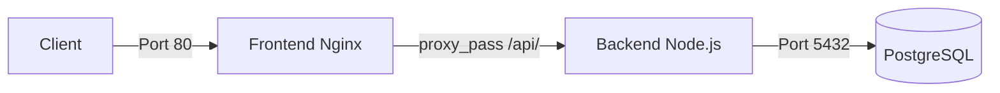

# VitalSync - Application de suivi médical et sportif

## Description

VitalSync est une application de suivi médical et sportif composée de trois services conteneurisés : une API backend Node.js/Express, un frontend servi par Nginx, et une base de données PostgreSQL. Le projet inclut une chaîne CI/CD complète avec GitHub Actions.

## Architecture


## Prérequis

- Docker et Docker Compose
- Git
- Node.js 20 (pour le développement local)

## Lancer le projet
```bash
# Cloner le repo
git clone https://github.com/ismax26/vitalsync.git
cd vitalsync

# Configurer les variables d'environnement
cp .env.example .env
# Modifier les valeurs dans .env

# Lancer les services
docker-compose up -d

# Vérifier que tout tourne
docker ps
```

## Pipeline CI/CD

La pipeline GitHub Actions comporte 3 étapes :

1. **Lint & Tests** : installation des dépendances, exécution d'ESLint et des tests Jest
2. **Build & Push** : construction des images Docker et push vers GitHub Container Registry (GHCR) avec tag SHA du commit
3. **Deploy staging** : déploiement via Docker Compose et vérification par health check sur /health

La pipeline se déclenche automatiquement sur chaque push sur `develop` et sur chaque Pull Request vers `main`.

## Choix techniques

- **Node.js 20 Alpine** : image légère pour réduire la surface d'attaque et la taille de l'image
- **Multi-stage build** : séparation du build/test et de la production pour une image finale minimale
- **Nginx** : serveur web performant pour servir le frontend et reverse proxy vers le backend
- **PostgreSQL 16 Alpine** : base de données relationnelle fiable avec image légère
- **GitHub Actions** : CI/CD intégrée à GitHub, pas besoin d'outil externe
- **GHCR** : registry d'images Docker intégré à GitHub, simplifie l'authentification
- **Réseau bridge dédié** : isolation des conteneurs pour la sécurité
- **Volume persistant** : conservation des données PostgreSQL entre les redémarrages

## Structure du projet
```
vitalsync/
├── backend/           # API Node.js/Express
├── frontend/          # Frontend HTML + Nginx
├── k8s/               # Manifestes Kubernetes
├── .github/workflows/ # Pipeline CI/CD
├── docker-compose.yml # Orchestration des services
└── .env.example       # Template des variables d'environnement
```